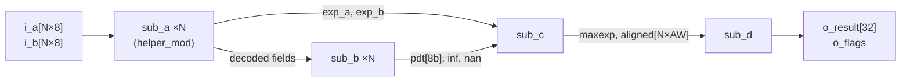
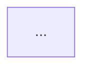

# write-AS — Architecture Specification Generator

Produce `doc/<module>.md` as a complete Architecture Specification for the target RTL module.

---

## Step 0 — Gather inputs

1. Identify the **target top module** from the user's prompt (module name, file path, or description).
2. If the user supplies a **block design figure** (image or diagram), treat it as ground truth for the block-design section — describe what is shown rather than inferring purely from RTL.
3. **Read the top module `.v` file completely** before writing anything.
4. Identify every module **directly instantiated** in the top file; read each of those sub-module `.v` files.
5. Check `doc/` for an existing AS to avoid rewriting what already exists.

---

## Step 1 — Extract from RTL

From the top module source, extract:

- Module name, parameters (names, defaults, derived localparams), and the mathematical spec from the header comment
- Full port list: direction, width expression, semantic description per port
- Whether the module is **combinational** (no `clk` / `always_ff`) or **pipelined** (`clk` present, `i_vld`/`o_vld` protocol)
- Pipeline latency in cycles (count `always_ff` stages on the critical path or read the header comment)
- Special-value semantics: NaN, Inf, overflow, saturation, flush-to-zero, etc.
- The direct instantiation list: sub-module name, instance count (generate loops → "×N"), and its role in the datapath

---

## Step 2 — Output

Write the AS to `doc/<module_name>.md`. If that file already exists, update it rather than overwriting wholesale. Do not write to `design/` or any RTL directory.

---

## Document structure (sections in order)

### 1. Function Description

Open with one paragraph:
- What the module **computes** (math or algorithm, not hardware structure)
- Input/output **formats** (e.g. FP8 E4M3/E5M2, IEEE-754 FP32, signed integer)
- **Combinational** or **pipelined**; if pipelined, the latency in cycles and the valid protocol
- Summary of **special-value** behavior

If the module handles NaN, Inf, zero, saturation, or overflow, add a special-value table:

| Condition | Result |
|-----------|--------|
| (each distinct special case) | (what the module emits) |

---

### 2. Parameters

Two tables:

**Configurable parameters** (declared as `parameter`):

| Parameter | Default | Constraint | Description |
|-----------|:-------:|------------|-------------|

**Derived constants** (declared as `localparam` and visible in the interface or to sub-modules):

| Constant | Value | Description |
|----------|:-----:|-------------|

---

### 3. Top Interface

Full port list. Group under `**Control ports**` and `**Data ports**` sub-headings when both exist.

| Port | Dir | Width | Description |
|------|:---:|:-----:|-------------|

Width must be exact (e.g. `N×8`, `AW+5`, `32`). Direction: `in` / `out`.

---

### 4. Block Design

Show the module's internal structure at the **direct-instantiation level** only (not sub-sub-modules).

#### If the user provides a block design figure
Re-draw it faithfully in Mermaid and add any signal annotations not visible in the figure.

#### If no block design is provided
Generate a Mermaid diagram from the RTL instantiation list.

**Mermaid template** (`flowchart LR` for datapath; `flowchart TD` for hierarchical/control-heavy):



**Mermaid rules for hardware diagrams:**
- Use `["..."]` for labels to allow special characters and `\n` line breaks
- Annotate edges with signal names/widths using `|"signal[W]"|`
- Represent all instances of a generate loop as a **single box** labeled `module_name ×N`
- Show sub-modules of sub-modules parenthetically in the box label: `"pdt_align\n(find_max + ALIGN_LANE×N)"`
- Keep width annotations brief: `[N×8]`, `[6b]`, `[N×AW]`
- Do not show primitive cells (full adders, flip-flops) as boxes — only named Verilog modules

---

### 5. Timing Diagrams

Generate **WaveDrom** JSON diagrams embedded in ` ```wavedrom ` code blocks.

**Mandatory diagrams:**

| Scenario | Always generate? |
|----------|:----------------:|
| Normal operation — single valid compute cycle | Yes |
| Back-to-back valid cycles (or pipeline fill) | Yes |
| Valid gating — output undefined when i_vld=0 | Combinational modules only |
| Special value (NaN / Inf / saturation) | If module has special values |
| Pipeline latency + bubble injection | Pipelined modules only |
| Reset behavior | If module has rst_n |

**WaveDrom reference:**

```json
{
  "signal": [
    { "name": "clk",         "wave": "p......." },
    { "name": "i_vld",       "wave": "0.1.1.0." },
    { "name": "i_a[N×8]",    "wave": "x.2.3.x.", "data": ["A_VEC_0", "A_VEC_1"] },
    { "name": "i_b[N×8]",    "wave": "x.2.3.x.", "data": ["B_VEC_0", "B_VEC_1"] },
    {},
    { "name": "o_vld",       "wave": "0.1.1.0." },
    { "name": "o_result[W]", "wave": "x.2.3.x.", "data": ["R0", "R1"] },
    { "name": "o_flag",      "wave": "0......." }
  ]
}
```

**Wave character quick-reference:**

| Char | Meaning |
|------|---------|
| `p` | Periodic positive-edge clock (oscillates every tick) |
| `n` | Periodic negative-edge clock |
| `0` / `1` | Constant low / high |
| `.` | Continue previous state (same color for buses, same level for wires) |
| `x` | Invalid / undefined — shown as hatched region |
| `z` | High impedance |
| `2`..`5` | Bus transition — blue / green / yellow / red; label via `"data": ["..."]` |
| `=` | Bus data continue — same color as previous `2`..`5` |
| `|` | Time-axis break (gap) |

**Timing rules:**

- **Combinational modules:** `o_vld` wave must be **identical** to `i_vld` wave. This visually proves zero-cycle latency. Bus output (`o_result`) wave must also match the input bus wave positions.
- **Pipelined modules:** shift the output wave right by **latency** ticks (one `.` per pipeline stage) relative to the input wave.
- Use `{}` (empty object row) to visually separate input group from output group.
- During idle (`o_vld = 0`) cycles, show bus outputs as `x` (undefined/don't-care).
- Keep each diagram to **8–12 ticks** for readability; use separate diagrams for different scenarios.
- Wave strings in one diagram **must all have the same length**. Count characters when writing.
- All JSON must be valid: no trailing commas, no comments inside the JSON block.

**Pipelined latency template (latency = 1 cycle):**

```json
{
  "signal": [
    { "name": "clk",    "wave": "p........." },
    { "name": "i_vld",  "wave": "0.1.1.1.0." },
    { "name": "i_a",    "wave": "x.2.3.4.x.", "data": ["A0","A1","A2"] },
    {},
    { "name": "o_vld",  "wave": "0..1.1.1.0" },
    { "name": "o_out",  "wave": "x..2.3.4.x", "data": ["R0","R1","R2"] }
  ]
}
```

*(Output starts 2 ticks after input starts — one tick is the registered stage, one tick for the clock edge.)*

---

### 6. Sub-module Descriptions

For each module **directly instantiated** under the top (one level only), write:

#### `<module_name>` — Short Descriptive Title

**File:** `design/path/module.v`
**Instances:** N (e.g., "16 — one per lane, generated via `for (i=0; i<N; i++)`")

One paragraph: what it computes, what it receives from its upstream stage, what it passes to its downstream stage. Mention any important sub-sub-modules parenthetically (e.g. "Internally wraps `find_max` and 16× `ALIGN_LANE`").

**Key ports** (interface to the top or adjacent sub-modules; omit internal-only wires):

| Port | Width | Description |
|------|:-----:|-------------|

**Special-value handling:** one short paragraph or bullet list (omit if not applicable).

**Block design** (Mermaid, if the sub-module itself is non-trivial — i.e. it contains 2+ important sub-sub-modules worth showing):



---

### 7. Module Hierarchy

A text tree showing the full direct-instantiation hierarchy (sub-sub-modules may be collapsed):

```
top_module
│
├── U_INSTANCE1 : sub_mod_a  (×N, generate loop)
│    ├── U_INNER : inner_a
│    └── U_INNER : inner_b
│
├── U_INSTANCE2 : sub_mod_b
│    └── U_INNER : inner_c
│
└── U_INSTANCE3 : sub_mod_c
```

---

## Quality checklist

Before finishing, verify:

- [ ] All port widths match the RTL exactly (not approximated)
- [ ] Parameter defaults match the RTL `parameter` declarations
- [ ] Special-value table covers every condition handled by the module
- [ ] Every WaveDrom diagram has consistent wave string lengths across all signals
- [ ] WaveDrom JSON is syntactically valid (no trailing commas, balanced braces)
- [ ] Combinational modules: `o_vld` and input bus waves are identical in timing
- [ ] Pipelined modules: output waves are shifted right by the correct latency
- [ ] Mermaid block design compiles (no unquoted special chars, no ambiguous arrows)
- [ ] Sub-module descriptions are one-level only (no sub-sub-module detail unless parenthetical)
- [ ] Function description says WHAT is computed (math), not HOW (pipeline stages, barrel shifts)
- [ ] Output file is in `doc/`, not `design/`
